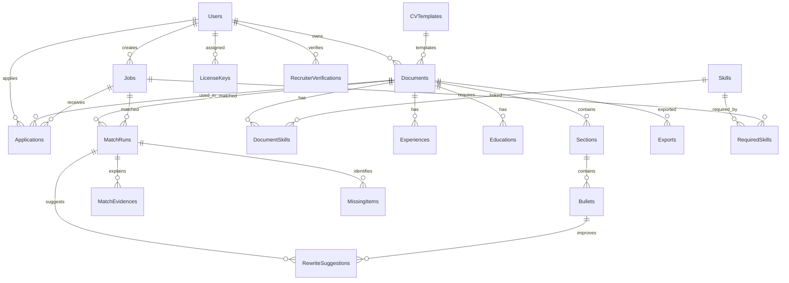
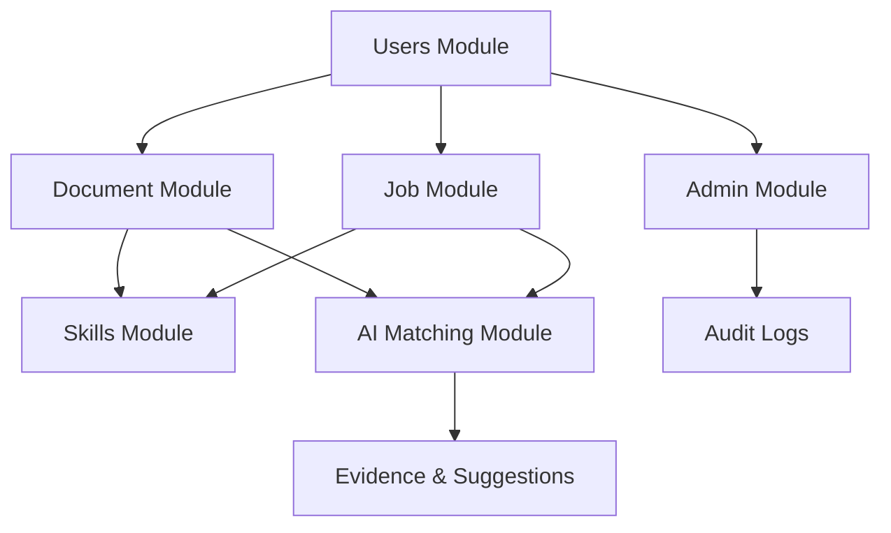

# BÁO CÁO CHI TIẾT CƠ SỞ DỮ LIỆU MATCHCV

**Phiên bản:** 1.0  
**Ngày tạo:** 14/12/2024  
**Dự án:** MatchCV - Hệ thống Matching CV và Job Description  

---

## MỤC LỤC

1. [Tổng quan hệ thống](#1-tổng-quan-hệ-thống)
2. [Sơ đồ kiến trúc Database](#2-sơ-đồ-kiến-trúc-database)
3. [Chi tiết các bảng](#3-chi-tiết-các-bảng)
4. [Quan hệ giữa các bảng](#4-quan-hệ-giữa-các-bảng)
5. [Indexes và Performance](#5-indexes-và-performance)
6. [Dữ liệu mẫu](#6-dữ-liệu-mẫu)
7. [Bảo mật và Constraints](#7-bảo-mật-và-constraints)

---

## 1. TỔNG QUAN HỆ THỐNG

### 1.1 Giới thiệu
MatchCV là hệ thống quản lý CV và tuyển dụng sử dụng AI để matching CV với Job Description. Database được thiết kế trên SQL Server với kiến trúc normalized, hỗ trợ:
- Quản lý người dùng (Candidate, Recruiter, Admin)
- Upload và parse CV/JD
- AI Matching & Scoring
- Quản lý ứng tuyển
- Báo cáo và audit logs

### 1.2 Thông tin Database
- **Database Name:** MatchCV
- **DBMS:** Microsoft SQL Server
- **Charset:** UTF-8 (NVARCHAR)
- **Timezone:** UTC (SYSUTCDATETIME())
- **Tổng số bảng:** 23 bảng chính

### 1.3 Cấu trúc Module
Database được chia thành các module chức năng:
1. **User Management** - Quản lý người dùng và xác thực
2. **Document Management** - Quản lý CV/JD và templates
3. **Skills & Experience** - Quản lý kỹ năng và kinh nghiệm
4. **Job & Application** - Quản lý công việc và ứng tuyển
5. **AI Matching** - Matching CV-JD và scoring
6. **Admin & Audit** - Quản trị và logs

---

## 2. SƠ ĐỒ KIẾN TRÚC DATABASE

### 2.1 Diagram Tổng quan



### 2.2 Module Diagram



---

## 3. CHI TIẾT CÁC BẢNG

### 3.1 MODULE USER MANAGEMENT

#### **Bảng: Users**
**Mục đích:** Quản lý tất cả người dùng trong hệ thống

| Cột | Kiểu dữ liệu | Ràng buộc | Mô tả |
|-----|--------------|-----------|-------|
| Id | INT IDENTITY(1,1) | PRIMARY KEY | ID tự tăng |
| DisplayName | NVARCHAR(180) | NOT NULL | Tên hiển thị |
| Email | NVARCHAR(250) | NOT NULL, UNIQUE | Email đăng nhập |
| Password | NVARCHAR(100) | NOT NULL | Mật khẩu (hashed) |
| Role | NVARCHAR(100) | NOT NULL | Vai trò: Candidate / Recruiter / Admin / System |
| Verified | BIT | NOT NULL, DEFAULT 0 | Trạng thái xác thực email |
| Headline | NVARCHAR(MAX) | NULL | Tiêu đề profile |
| Bio | NVARCHAR(MAX) | NULL | Giới thiệu bản thân |
| CreatedAt | DATETIME2 | NOT NULL, DEFAULT SYSUTCDATETIME() | Ngày tạo |
| UpdatedAt | DATETIME2 | NULL | Ngày cập nhật |
| IsActive | BIT | NOT NULL, DEFAULT 1 | Trạng thái hoạt động |
| IsDeleted | BIT | NOT NULL, DEFAULT 0 | Soft delete flag |

**Indexes:**
- `UQ__Users__A9D10534A0824C3B` (UNIQUE): Email
- `IX_Users_Role`: Role (WHERE IsDeleted = 0)
- `IX_Users_IsActive_IsDeleted`: IsActive, IsDeleted

**Business Rules:**
- Email phải là duy nhất
- Role phải thuộc danh sách: Candidate, Recruiter, Admin, System
- Soft delete: IsDeleted = 1 thay vì xóa record

---

#### **Bảng: EmailVerificationTokens**
**Mục đích:** Lưu token xác thực email

| Cột | Kiểu dữ liệu | Ràng buộc | Mô tả |
|-----|--------------|-----------|-------|
| Id | INT IDENTITY(1,1) | PRIMARY KEY | ID tự tăng |
| UserId | INT | NOT NULL, FK | ID người dùng |
| Token | NVARCHAR(500) | NOT NULL | Token xác thực |
| ExpiresAt | DATETIME2 | NOT NULL | Thời gian hết hạn |

**Foreign Keys:**
- UserId → Users(Id) ON DELETE CASCADE

**Indexes:**
- `IX_EmailVerificationTokens_UserId`: UserId
- `IX_EmailVerificationTokens_Token`: Token
- `IX_EmailVerificationTokens_ExpiresAt`: ExpiresAt

---

#### **Bảng: RecruiterVerifications**
**Mục đích:** Quản lý xác thực tài khoản Recruiter

| Cột | Kiểu dữ liệu | Ràng buộc | Mô tả |
|-----|--------------|-----------|-------|
| Id | INT IDENTITY(1,1) | PRIMARY KEY | ID tự tăng |
| RecruiterId | INT | NOT NULL, FK | ID nhà tuyển dụng |
| CompanyName | NVARCHAR(200) | NOT NULL | Tên công ty |
| CompanyEmail | NVARCHAR(250) | NOT NULL | Email công ty |
| CompanyPhone | NVARCHAR(50) | NULL | SĐT công ty |
| CompanyAddress | NVARCHAR(200) | NULL | Địa chỉ công ty |
| TaxCode | NVARCHAR(50) | NULL | Mã số thuế |
| BusinessLicenseDocumentId | INT | NULL, FK | ID tài liệu GPHĐKD |
| CompanyProofDocumentId | INT | NULL, FK | ID tài liệu chứng minh |
| Status | NVARCHAR(30) | NOT NULL, DEFAULT 'Pending' | Trạng thái: Pending / Approved / Rejected |
| AdminNotes | NVARCHAR(500) | NULL | Ghi chú của Admin |
| ReviewedByAdminId | INT | NULL, FK | ID Admin duyệt |
| ReviewedAt | DATETIME2 | NULL | Ngày duyệt |
| CreatedAt | DATETIME2 | NOT NULL, DEFAULT SYSUTCDATETIME() | Ngày tạo |
| UpdatedAt | DATETIME2 | NULL | Ngày cập nhật |

**Foreign Keys:**
- RecruiterId → Users(Id) ON DELETE CASCADE
- BusinessLicenseDocumentId → Documents(Id) ON DELETE NO ACTION
- CompanyProofDocumentId → Documents(Id) ON DELETE NO ACTION
- ReviewedByAdminId → Users(Id) ON DELETE NO ACTION

**Constraints:**
- `CK_RecruiterVerification_Status`: Status IN ('Pending', 'Approved', 'Rejected')

**Indexes:**
- `IX_RecruiterVerification_RecruiterId`: RecruiterId
- `IX_RecruiterVerification_Status`: Status
- `IX_RecruiterVerification_CreatedAt`: CreatedAt

---

### 3.2 MODULE DOCUMENT MANAGEMENT

#### **Bảng: Documents**
**Mục đích:** Lưu trữ CV, JD và các tài liệu khác

| Cột | Kiểu dữ liệu | Ràng buộc | Mô tả |
|-----|--------------|-----------|-------|
| Id | INT IDENTITY(1,1) | PRIMARY KEY | ID tự tăng |
| UserId | INT | NULL, FK | ID người sở hữu |
| TemplateId | INT | NULL, FK | ID template CV |
| DocType | NVARCHAR(30) | NOT NULL | Loại: CV / JD / CL / Other |
| OriginalName | NVARCHAR(250) | NOT NULL | Tên file gốc |
| FileName | NVARCHAR(255) | NULL | Tên file lưu trữ |
| Content | NVARCHAR(4000) | NULL | Nội dung trích xuất (tóm tắt) |
| ContentType | NVARCHAR(100) | NULL | MIME type |
| StoragePath | NVARCHAR(400) | NULL | Đường dẫn file |
| FileHash | NVARCHAR(128) | NULL | Hash để kiểm tra trùng lặp |
| FileSize | BIGINT | NULL | Kích thước file (bytes) |
| PageCount | INT | NULL | Số trang |
| AiConfidence | FLOAT | NULL | Độ tin cậy AI parsing |
| TotalScore | FLOAT | NULL | Điểm tổng quát |
| Status | NVARCHAR(50) | NOT NULL, DEFAULT 'Draft' | Draft / Active / Archived |
| CreatedAt | DATETIME2 | NOT NULL, DEFAULT SYSUTCDATETIME() | Ngày tạo |
| UpdatedAt | DATETIME2 | NOT NULL, DEFAULT SYSUTCDATETIME() | Ngày cập nhật |
| CvData | NVARCHAR(MAX) | NULL | JSON data từ CV Builder |
| IsDeleted | BIT | NOT NULL, DEFAULT 0 | Soft delete flag |

**Foreign Keys:**
- UserId → Users(Id)
- TemplateId → CVTemplates(Id)

**Indexes:**
- `IX_Documents_DocType`: DocType
- `IX_Documents_Uploaded`: CreatedAt
- `IX_Documents_UserId`: UserId
- `IX_Documents_Status_IsDeleted`: Status, IsDeleted (WHERE IsDeleted = 0)
- `IX_Documents_TemplateId`: TemplateId (WHERE TemplateId IS NOT NULL)

---

#### **Bảng: CVTemplates**
**Mục đích:** Lưu trữ các mẫu CV

| Cột | Kiểu dữ liệu | Ràng buộc | Mô tả |
|-----|--------------|-----------|-------|
| Id | INT IDENTITY(1,1) | PRIMARY KEY | ID tự tăng |
| Key | NVARCHAR(50) | NOT NULL, UNIQUE | Key định danh: professional, modern, formal, creative, minimalist |
| Name | NVARCHAR(180) | NOT NULL | Tên template |
| Description | NVARCHAR(300) | NULL | Mô tả |
| Engine | NVARCHAR(50) | NULL, DEFAULT 'razor' | Engine render: razor, html |
| TemplatePath | NVARCHAR(400) | NULL, DEFAULT '' | Đường dẫn template file |
| IsActive | BIT | NOT NULL, DEFAULT 1 | Trạng thái kích hoạt |
| ThumbnailUrl | NVARCHAR(500) | NULL | URL ảnh thumbnail |
| PreviewImageUrl | NVARCHAR(500) | NULL | URL ảnh preview |
| ProfileImageUrl | NVARCHAR(500) | NULL | URL ảnh profile |
| FullName | NVARCHAR(100) | NULL | Tên mẫu |
| Email | NVARCHAR(100) | NULL | Email mẫu |
| Phone | NVARCHAR(20) | NULL | SĐT mẫu |
| Address | NVARCHAR(500) | NULL | Địa chỉ mẫu |
| CVData | NVARCHAR(MAX) | NULL | JSON data mẫu |
| CreatedAt | DATETIME2 | NOT NULL, DEFAULT SYSUTCDATETIME() | Ngày tạo |
| UpdatedAt | DATETIME2 | NULL | Ngày cập nhật |

**Indexes:**
- `UQ__CVTempla__C41E0289DE48762E` (UNIQUE): Key

**Dữ liệu mẫu:**
- professional: Mẫu Chuyên Nghiệp (đỏ, sidebar)
- modern: Mẫu Hiện Đại (tím, header tập trung)
- formal: Mẫu Truyền Thống (đơn giản, tối giản)
- creative: Mẫu Sáng Tạo (màu sắc tươi sáng)
- minimalist: Mẫu Tối Giản (tập trung nội dung)

---

#### **Bảng: Sections**
**Mục đích:** Lưu các section trong CV (Profile, Experience, Education, Skills...)

| Cột | Kiểu dữ liệu | Ràng buộc | Mô tả |
|-----|--------------|-----------|-------|
| Id | INT IDENTITY(1,1) | PRIMARY KEY | ID tự tăng |
| DocumentId | INT | NOT NULL, FK | ID document |
| SectionType | NVARCHAR(50) | NOT NULL | Loại section: Profile, Experience, Education, Skills... |
| Ord | INT | NOT NULL | Thứ tự sắp xếp |
| RawText | NVARCHAR(MAX) | NULL | Văn bản gốc |

**Foreign Keys:**
- DocumentId → Documents(Id) ON DELETE CASCADE

**Indexes:**
- `IX_Sections_DocumentId`: DocumentId
- `IX_Sections_DocumentId_SectionType`: DocumentId, SectionType

---

#### **Bảng: Bullets**
**Mục đích:** Lưu các bullet point trong Section

| Cột | Kiểu dữ liệu | Ràng buộc | Mô tả |
|-----|--------------|-----------|-------|
| Id | INT IDENTITY(1,1) | PRIMARY KEY | ID tự tăng |
| SectionId | INT | NOT NULL, FK | ID section |
| Ord | INT | NOT NULL | Thứ tự |
| Text | NVARCHAR(MAX) | NOT NULL | Nội dung bullet |

**Foreign Keys:**
- SectionId → Sections(Id) ON DELETE CASCADE

**Indexes:**
- `IX_Bullets_SectionId`: SectionId

---

#### **Bảng: OCRResults**
**Mục đích:** Lưu kết quả OCR từ ảnh/PDF

| Cột | Kiểu dữ liệu | Ràng buộc | Mô tả |
|-----|--------------|-----------|-------|
| Id | INT IDENTITY(1,1) | PRIMARY KEY | ID tự tăng |
| DocumentId | INT | NOT NULL, FK | ID document |
| Engine | NVARCHAR(50) | NOT NULL | OCR engine: Tesseract, Azure, AWS... |
| AvgConfidence | FLOAT | NULL | Độ tin cậy trung bình |
| TextBlob | NVARCHAR(MAX) | NULL | Văn bản trích xuất |
| CreatedAt | DATETIME2 | NOT NULL, DEFAULT SYSUTCDATETIME() | Ngày tạo |

**Foreign Keys:**
- DocumentId → Documents(Id) ON DELETE CASCADE

**Indexes:**
- `IX_OCRResults_DocumentId`: DocumentId
- `IX_OCRResults_CreatedAt`: CreatedAt

---

#### **Bảng: Exports**
**Mục đích:** Lịch sử xuất file CV/JD

| Cột | Kiểu dữ liệu | Ràng buộc | Mô tả |
|-----|--------------|-----------|-------|
| Id | INT IDENTITY(1,1) | PRIMARY KEY | ID tự tăng |
| DocumentId | INT | NOT NULL, FK | ID document |
| TemplateId | INT | NULL, FK | ID template sử dụng |
| OutFormat | NVARCHAR(30) | NOT NULL | Format: PDF, DOCX, HTML |
| OutputPath | NVARCHAR(400) | NOT NULL | Đường dẫn file xuất |
| Engine | NVARCHAR(50) | NULL | Engine: Razor, Puppeteer... |
| CreatedAt | DATETIME2 | NOT NULL, DEFAULT SYSUTCDATETIME() | Ngày xuất |
| Status | NVARCHAR(30) | NOT NULL | Success / Failed / Pending |
| ErrorMsg | NVARCHAR(200) | NULL | Thông báo lỗi |

**Foreign Keys:**
- DocumentId → Documents(Id) ON DELETE CASCADE
- TemplateId → CVTemplates(Id)

**Indexes:**
- `IX_Exports_DocumentId`: DocumentId
- `IX_Exports_Status_CreatedAt`: Status, CreatedAt

---

#### **Bảng: SavedCVs**
**Mục đích:** Lưu CV đã built từ CV Builder

| Cột | Kiểu dữ liệu | Ràng buộc | Mô tả |
|-----|--------------|-----------|-------|
| Id | INT IDENTITY(1,1) | PRIMARY KEY | ID tự tăng |
| Title | NVARCHAR(200) | NOT NULL | Tiêu đề CV |
| TemplateType | NVARCHAR(50) | NOT NULL | Loại template |
| CVDataJson | NVARCHAR(MAX) | NOT NULL | Dữ liệu JSON đầy đủ |
| CreatedAt | DATETIME2 | NOT NULL, DEFAULT SYSUTCDATETIME() | Ngày tạo |
| UpdatedAt | DATETIME2 | NOT NULL, DEFAULT SYSUTCDATETIME() | Ngày cập nhật |
| UserId | INT | NULL, FK | ID user (future) |

**Foreign Keys:**
- UserId → Users(Id)

**Indexes:**
- `IX_SavedCVs_UserId`: UserId (WHERE UserId IS NOT NULL)
- `IX_SavedCVs_CreatedAt`: CreatedAt

---

### 3.3 MODULE SKILLS & EXPERIENCE

#### **Bảng: Skills**
**Mục đích:** Từ điển kỹ năng

| Cột | Kiểu dữ liệu | Ràng buộc | Mô tả |
|-----|--------------|-----------|-------|
| Id | INT IDENTITY(1,1) | PRIMARY KEY | ID tự tăng |
| Name | NVARCHAR(180) | NOT NULL | Tên skill |
| NormName | NVARCHAR(180) | NOT NULL, UNIQUE | Tên chuẩn hóa (lowercase) |
| Category | NVARCHAR(80) | NULL | Danh mục: Backend, Frontend, Database, Cloud, Tools |
| CreatedAt | DATETIME2 | NOT NULL, DEFAULT SYSUTCDATETIME() | Ngày tạo |
| UpdatedAt | DATETIME2 | NOT NULL, DEFAULT SYSUTCDATETIME() | Ngày cập nhật |
| IsDeleted | BIT | NOT NULL, DEFAULT 0 | Soft delete |

**Indexes:**
- `IX_Skills_NormName` (UNIQUE): NormName

**Dữ liệu mẫu:**
- Backend: .NET, C#, ASP.NET Core, Node.js, Python, Java, Spring Boot, REST API, GraphQL
- Database: SQL, SQL Server, MySQL, PostgreSQL, MongoDB
- Frontend: React, ReactJS, Vue.js, Angular, JavaScript, TypeScript, HTML, CSS, Next.js
- Cloud: Azure, AWS, Docker, Kubernetes
- Tools: Git, GitHub, JIRA

---

#### **Bảng: DocumentSkills**
**Mục đích:** Liên kết skill với Document (CV)

| Cột | Kiểu dữ liệu | Ràng buộc | Mô tả |
|-----|--------------|-----------|-------|
| Id | INT IDENTITY(1,1) | PRIMARY KEY | ID tự tăng |
| DocumentId | INT | NOT NULL, FK | ID document |
| SkillId | INT | NOT NULL, FK | ID skill |
| Source | NVARCHAR(30) | NOT NULL, DEFAULT 'User' | Nguồn: User / AI / OCR |
| Years | FLOAT | NULL | Số năm kinh nghiệm (legacy) |
| YearsExperience | FLOAT | NULL | Số năm kinh nghiệm |
| Proficiency | NVARCHAR(50) | NULL | Mức độ: Cơ bản, Trung bình, Thành thạo, Xuất sắc |
| Confidence | FLOAT | NULL | Độ tin cậy AI |
| CreatedAt | DATETIME2 | NOT NULL, DEFAULT SYSUTCDATETIME() | Ngày tạo |

**Foreign Keys:**
- DocumentId → Documents(Id) ON DELETE CASCADE
- SkillId → Skills(Id) ON DELETE CASCADE

**Indexes:**
- `IX_DocumentSkills_DocumentId`: DocumentId
- `IX_DocumentSkills_SkillId`: SkillId
- `IX_DocumentSkills_Document_Skill` (UNIQUE): DocumentId, SkillId

---

#### **Bảng: Experiences**
**Mục đích:** Kinh nghiệm làm việc trong CV

| Cột | Kiểu dữ liệu | Ràng buộc | Mô tả |
|-----|--------------|-----------|-------|
| Id | INT IDENTITY(1,1) | PRIMARY KEY | ID tự tăng |
| DocumentId | INT | NOT NULL, FK | ID document |
| JobTitle | NVARCHAR(200) | NOT NULL | Vị trí công việc |
| CompanyName | NVARCHAR(200) | NOT NULL | Tên công ty |
| IndustryName | NVARCHAR(150) | NULL | Ngành nghề |
| StartDate | DATE | NULL | Ngày bắt đầu |
| EndDate | DATE | NULL | Ngày kết thúc |
| CurrentlyWorking | BIT | NOT NULL, DEFAULT 0 | Đang làm việc |
| Description | NVARCHAR(MAX) | NULL | Mô tả công việc |
| CreatedAt | DATETIME2 | NOT NULL, DEFAULT SYSUTCDATETIME() | Ngày tạo |

**Foreign Keys:**
- DocumentId → Documents(Id) ON DELETE CASCADE

**Indexes:**
- `IX_Experiences_DocumentId`: DocumentId

---

#### **Bảng: Educations**
**Mục đích:** Học vấn trong CV

| Cột | Kiểu dữ liệu | Ràng buộc | Mô tả |
|-----|--------------|-----------|-------|
| Id | INT IDENTITY(1,1) | PRIMARY KEY | ID tự tăng |
| DocumentId | INT | NOT NULL, FK | ID document |
| Degree | NVARCHAR(150) | NOT NULL | Bằng cấp |
| FieldOfStudy | NVARCHAR(150) | NULL | Chuyên ngành |
| SchoolName | NVARCHAR(200) | NOT NULL | Tên trường |
| StartDate | DATE | NULL | Ngày bắt đầu |
| EndDate | DATE | NULL | Ngày kết thúc |
| Score | FLOAT | NULL | Điểm GPA |
| Activities | NVARCHAR(MAX) | NULL | Hoạt động |
| Description | NVARCHAR(MAX) | NULL | Mô tả |
| CreatedAt | DATETIME2 | NOT NULL, DEFAULT SYSUTCDATETIME() | Ngày tạo |

**Foreign Keys:**
- DocumentId → Documents(Id) ON DELETE CASCADE

**Indexes:**
- `IX_Educations_DocumentId`: DocumentId

---

### 3.4 MODULE JOB & APPLICATION

#### **Bảng: Jobs**
**Mục đích:** Quản lý công việc/tin tuyển dụng

| Cột | Kiểu dữ liệu | Ràng buộc | Mô tả |
|-----|--------------|-----------|-------|
| Id | INT IDENTITY(1,1) | PRIMARY KEY | ID tự tăng |
| UserId | INT | NOT NULL, FK | ID Recruiter tạo job |
| Title | NVARCHAR(200) | NOT NULL | Tiêu đề công việc |
| Company | NVARCHAR(200) | NOT NULL | Tên công ty |
| RawText | NVARCHAR(MAX) | NULL | JD gốc |
| JobDescription | NVARCHAR(MAX) | NULL | Mô tả parsed |
| Status | NVARCHAR(50) | NOT NULL, DEFAULT 'Active' | Active / Closed / Draft |
| CreatedAt | DATETIME2 | NOT NULL, DEFAULT SYSUTCDATETIME() | Ngày tạo |
| UpdatedAt | DATETIME2 | NOT NULL, DEFAULT SYSUTCDATETIME() | Ngày cập nhật |

**Foreign Keys:**
- UserId → Users(Id) ON DELETE CASCADE

**Indexes:**
- `IX_Jobs_UserId`: UserId
- `IX_Jobs_Status`: Status (WHERE Status = 'Active')
- `IX_Jobs_CreatedAt`: CreatedAt

---

#### **Bảng: RequiredSkills**
**Mục đích:** Kỹ năng yêu cầu cho Job

| Cột | Kiểu dữ liệu | Ràng buộc | Mô tả |
|-----|--------------|-----------|-------|
| Id | INT IDENTITY(1,1) | PRIMARY KEY | ID tự tăng |
| JobId | INT | NOT NULL, FK | ID job |
| SkillId | INT | NOT NULL, FK | ID skill |
| MustHave | BIT | NOT NULL, DEFAULT 0 | Bắt buộc hay không |
| Weight | FLOAT | NULL | Trọng số (0-1) |
| Note | NVARCHAR(200) | NULL | Ghi chú |

**Foreign Keys:**
- JobId → Jobs(Id) ON DELETE CASCADE
- SkillId → Skills(Id) ON DELETE CASCADE

**Indexes:**
- `IX_RequiredSkills_JobId`: JobId
- `IX_RequiredSkills_SkillId`: SkillId
- `IX_RequiredSkills_Job_Skill` (UNIQUE): JobId, SkillId

---

#### **Bảng: Applications**
**Mục đích:** Quản lý đơn ứng tuyển

| Cột | Kiểu dữ liệu | Ràng buộc | Mô tả |
|-----|--------------|-----------|-------|
| Id | INT IDENTITY(1,1) | PRIMARY KEY | ID tự tăng |
| JobId | INT | NOT NULL, FK | ID job |
| DocumentId | INT | NOT NULL, FK | ID CV document |
| CandidateId | INT | NOT NULL, FK | ID ứng viên |
| Status | NVARCHAR(30) | NOT NULL, DEFAULT 'Pending' | Pending / Reviewing / Approved / Rejected |
| ScoreSnapshot | FLOAT | NULL | Snapshot điểm match |
| Summary | NVARCHAR(MAX) | NULL | Tóm tắt |
| CreatedAt | DATETIME2 | NOT NULL, DEFAULT SYSUTCDATETIME() | Ngày nộp |
| UpdatedAt | DATETIME2 | NULL | Ngày cập nhật |

**Foreign Keys:**
- JobId → Jobs(Id) ON DELETE CASCADE
- DocumentId → Documents(Id) ON DELETE CASCADE
- CandidateId → Users(Id) ON DELETE NO ACTION

**Indexes:**
- `IX_Applications_JobId`: JobId
- `IX_Applications_CandidateId`: CandidateId
- `IX_Applications_Status`: Status
- `IX_Applications_CreatedAt`: CreatedAt

---

### 3.5 MODULE AI MATCHING

#### **Bảng: MatchRuns**
**Mục đích:** Lưu kết quả chạy AI matching CV-JD

| Cột | Kiểu dữ liệu | Ràng buộc | Mô tả |
|-----|--------------|-----------|-------|
| Id | INT IDENTITY(1,1) | PRIMARY KEY | ID tự tăng |
| DocumentId | INT | NOT NULL, FK | ID CV |
| JobId | INT | NOT NULL, FK | ID Job |
| Score | FLOAT | NOT NULL | Điểm match (0-100) |
| DurationMs | INT | NULL | Thời gian chạy (ms) |
| Explanation | NVARCHAR(MAX) | NULL | Giải thích tổng quát |
| CreatedAt | DATETIME2 | NOT NULL, DEFAULT SYSUTCDATETIME() | Ngày chạy |
| TraceId | NVARCHAR(180) | NULL | Trace ID để tracking |

**Foreign Keys:**
- DocumentId → Documents(Id) ON DELETE CASCADE
- JobId → Jobs(Id) ON DELETE CASCADE

**Indexes:**
- `IX_MatchRuns_Document_Job`: DocumentId, JobId
- `IX_MatchRuns_CreatedAt`: CreatedAt
- `IX_MatchRuns_Score`: Score

---

#### **Bảng: MatchEvidences**
**Mục đích:** Bằng chứng/giải thích vì sao match

| Cột | Kiểu dữ liệu | Ràng buộc | Mô tả |
|-----|--------------|-----------|-------|
| Id | INT IDENTITY(1,1) | PRIMARY KEY | ID tự tăng |
| MatchId | INT | NOT NULL, FK | ID match run |
| SkillId | INT | NULL, FK | ID skill liên quan |
| Snippet | NVARCHAR(MAX) | NULL | Đoạn text minh chứng |
| ComponentScore | FLOAT | NULL | Điểm thành phần |
| EvidenceType | NVARCHAR(30) | NULL | Skill / Experience / Edu / Other |

**Foreign Keys:**
- MatchId → MatchRuns(Id) ON DELETE CASCADE
- SkillId → Skills(Id) ON DELETE SET NULL

**Indexes:**
- `IX_MatchEvidences_MatchId`: MatchId
- `IX_MatchEvidences_SkillId`: SkillId (WHERE SkillId IS NOT NULL)

---

#### **Bảng: MissingItems**
**Mục đích:** Skill bắt buộc nhưng thiếu trong CV

| Cột | Kiểu dữ liệu | Ràng buộc | Mô tả |
|-----|--------------|-----------|-------|
| Id | INT IDENTITY(1,1) | PRIMARY KEY | ID tự tăng |
| MatchId | INT | NOT NULL, FK | ID match run |
| SkillId | INT | NULL, FK | ID skill thiếu |
| MissingKeyword | NVARCHAR(180) | NULL | Từ khóa thiếu |
| Reason | NVARCHAR(300) | NULL | Lý do |
| Suggestion | NVARCHAR(300) | NULL | Gợi ý |
| MustHave | BIT | NOT NULL, DEFAULT 0 | Bắt buộc hay không |

**Foreign Keys:**
- MatchId → MatchRuns(Id) ON DELETE CASCADE
- SkillId → Skills(Id) ON DELETE SET NULL

**Indexes:**
- `IX_MissingItems_MatchId`: MatchId
- `IX_MissingItems_MustHave`: MustHave (WHERE MustHave = 1)

---

#### **Bảng: RewriteSuggestions**
**Mục đích:** Gợi ý chỉnh sửa bullet/câu trong CV

| Cột | Kiểu dữ liệu | Ràng buộc | Mô tả |
|-----|--------------|-----------|-------|
| Id | INT IDENTITY(1,1) | PRIMARY KEY | ID tự tăng |
| MatchId | INT | NOT NULL, FK | ID match run |
| BulletId | INT | NULL, FK | ID bullet cần sửa |
| SuggestedText | NVARCHAR(MAX) | NOT NULL | Văn bản gợi ý |
| Rationale | NVARCHAR(MAX) | NULL | Lý do |
| Accepted | BIT | NOT NULL, DEFAULT 0 | User chấp nhận hay chưa |
| CreatedAt | DATETIME2 | NOT NULL, DEFAULT SYSUTCDATETIME() | Ngày tạo |
| AcceptedAt | DATETIME2 | NULL | Ngày chấp nhận |

**Foreign Keys:**
- MatchId → MatchRuns(Id) ON DELETE CASCADE
- BulletId → Bullets(Id) ON DELETE NO ACTION

**Indexes:**
- `IX_RewriteSuggestions_MatchId`: MatchId
- `IX_RewriteSuggestions_Accepted`: Accepted (WHERE Accepted = 0)

---

### 3.6 MODULE EMBEDDINGS (SEMANTIC SEARCH)

#### **Bảng: Embeddings**
**Mục đích:** Lưu vector embeddings cho semantic search

| Cột | Kiểu dữ liệu | Ràng buộc | Mô tả |
|-----|--------------|-----------|-------|
| Id | INT IDENTITY(1,1) | PRIMARY KEY | ID tự tăng |
| Dim | INT | NOT NULL | Số chiều vector |
| Model | NVARCHAR(80) | NOT NULL | Model: text-embedding-ada-002, bert... |
| Vector | VARBINARY(MAX) | NOT NULL | Vector binary |
| CreatedAt | DATETIME2 | NOT NULL, DEFAULT SYSUTCDATETIME() | Ngày tạo |

---

#### **Bảng: EmbeddingOwnership**
**Mục đích:** Liên kết embedding với entity

| Cột | Kiểu dữ liệu | Ràng buộc | Mô tả |
|-----|--------------|-----------|-------|
| Id | INT IDENTITY(1,1) | PRIMARY KEY | ID tự tăng |
| EmbeddingId | INT | NOT NULL, FK | ID embedding |
| OwnerType | NVARCHAR(30) | NOT NULL | Document / Job / Skill / Section |
| OwnerId | INT | NOT NULL | ID của entity |

**Foreign Keys:**
- EmbeddingId → Embeddings(Id) ON DELETE CASCADE

---

#### **Bảng: EmbeddingCache**
**Mục đích:** Cache embedding để tránh gọi API lại

| Cột | Kiểu dữ liệu | Ràng buộc | Mô tả |
|-----|--------------|-----------|-------|
| Id | INT IDENTITY(1,1) | PRIMARY KEY | ID tự tăng |
| InputHash | NVARCHAR(128) | NOT NULL, UNIQUE | Hash của input text |
| Model | NVARCHAR(80) | NOT NULL | Model |
| Dim | INT | NOT NULL | Số chiều |
| Vector | VARBINARY(MAX) | NOT NULL | Vector binary |
| CreatedAt | DATETIME2 | NOT NULL, DEFAULT SYSUTCDATETIME() | Ngày tạo |

---

### 3.7 MODULE ADMIN & AUDIT

#### **Bảng: APICallLogs**
**Mục đích:** Log các lần gọi AI API (OpenAI, Azure...)

| Cột | Kiểu dữ liệu | Ràng buộc | Mô tả |
|-----|--------------|-----------|-------|
| Id | INT IDENTITY(1,1) | PRIMARY KEY | ID tự tăng |
| Provider | NVARCHAR(50) | NOT NULL | OpenAI, Azure, Anthropic... |
| Model | NVARCHAR(80) | NOT NULL | gpt-4, gpt-3.5-turbo... |
| Endpoint | NVARCHAR(180) | NOT NULL | API endpoint |
| TokensIn | INT | NULL | Tokens input |
| TokensOut | INT | NULL | Tokens output |
| CostEstimate | FLOAT | NULL | Ước tính chi phí ($) |
| LatencyMs | INT | NULL | Độ trễ (ms) |
| Status | NVARCHAR(30) | NOT NULL | Success / Failed / Timeout |
| CreatedAt | DATETIME2 | NOT NULL, DEFAULT SYSUTCDATETIME() | Ngày gọi |
| TraceId | NVARCHAR(180) | NULL | Trace ID |

---

#### **Bảng: APISettings**
**Mục đích:** Cấu hình API keys

| Cột | Kiểu dữ liệu | Ràng buộc | Mô tả |
|-----|--------------|-----------|-------|
| Id | INT IDENTITY(1,1) | PRIMARY KEY | ID tự tăng |
| Provider | NVARCHAR(50) | NOT NULL | Provider |
| Model | NVARCHAR(80) | NOT NULL | Model |
| Endpoint | NVARCHAR(180) | NOT NULL | Endpoint |
| ApiKey | NVARCHAR(256) | NOT NULL | API Key (encrypted) |
| IsActive | BIT | NOT NULL, DEFAULT 1 | Kích hoạt |
| CreatedAt | DATETIME2 | NOT NULL, DEFAULT SYSUTCDATETIME() | Ngày tạo |

---

#### **Bảng: LicenseKeys**
**Mục đích:** Quản lý license Free/Pro

| Cột | Kiểu dữ liệu | Ràng buộc | Mô tả |
|-----|--------------|-----------|-------|
| Id | INT IDENTITY(1,1) | PRIMARY KEY | ID tự tăng |
| KeyHash | NVARCHAR(200) | NOT NULL, UNIQUE | Hash của license key |
| Plan | NVARCHAR(30) | NOT NULL, DEFAULT 'Free' | Free / Pro |
| Expiry | DATETIME2 | NULL | Ngày hết hạn |
| IsActive | BIT | NOT NULL, DEFAULT 0 | Kích hoạt |
| AssignedUserId | INT | NULL, FK | ID user được gán |
| CreatedAt | DATETIME2 | NOT NULL, DEFAULT SYSUTCDATETIME() | Ngày tạo |

**Foreign Keys:**
- AssignedUserId → Users(Id) ON DELETE SET NULL

---

#### **Bảng: AdminLogs**
**Mục đích:** Audit log cho Admin Dashboard

| Cột | Kiểu dữ liệu | Ràng buộc | Mô tả |
|-----|--------------|-----------|-------|
| Id | INT IDENTITY(1,1) | PRIMARY KEY | ID tự tăng |
| Actor | NVARCHAR(200) | NOT NULL | Email/User thực hiện |
| Action | NVARCHAR(100) | NOT NULL | Create, Update, Delete, Approve, Reject... |
| Entity | NVARCHAR(100) | NOT NULL | User, Job, Application... |
| EntityId | INT | NULL | ID của entity |
| MetaJson | NVARCHAR(MAX) | NOT NULL, DEFAULT '{}' | Metadata JSON |
| CreatedAt | DATETIME2 | NOT NULL, DEFAULT SYSUTCDATETIME() | Ngày thực hiện |

**Indexes:**
- `IX_AdminLogs_CreatedAt`: CreatedAt
- `IX_AdminLogs_Entity_EntityId`: Entity, EntityId

---

## 4. QUAN HỆ GIỮA CÁC BẢNG

### 4.1 Foreign Key Relationships

#### **Users Hub (Trung tâm)**
```
Users (1) ──┬──> (N) Documents
            ├──> (N) Jobs
            ├──> (N) Applications (as Candidate)
            ├──> (N) LicenseKeys (assigned)
            ├──> (N) RecruiterVerifications (as Recruiter)
            ├──> (N) RecruiterVerifications (as Admin reviewer)
            └──> (N) SavedCVs
```

#### **Documents Hub**
```
Documents (1) ──┬──> (N) Sections
                ├──> (N) DocumentSkills
                ├──> (N) Experiences
                ├──> (N) Educations
                ├──> (N) OCRResults
                ├──> (N) Exports
                ├──> (N) Applications
                └──> (N) MatchRuns

CVTemplates (1) ───> (N) Documents
```

#### **Skills Hub**
```
Skills (1) ──┬──> (N) DocumentSkills
             ├──> (N) RequiredSkills
             └──> (N) MatchEvidences
```

#### **Jobs Hub**
```
Jobs (1) ──┬──> (N) RequiredSkills
           ├──> (N) Applications
           └──> (N) MatchRuns
```

#### **Matching Hub**
```
MatchRuns (1) ──┬──> (N) MatchEvidences
                ├──> (N) MissingItems
                └──> (N) RewriteSuggestions

Sections (1) ───> (N) Bullets
Bullets (1) ───> (N) RewriteSuggestions
```

#### **Embeddings Hub**
```
Embeddings (1) ───> (N) EmbeddingOwnership
```

### 4.2 Cascade Delete Policies

| Parent → Child | Delete Policy | Lý do |
|----------------|---------------|-------|
| Users → Documents | CASCADE | Xóa user → xóa CV của user |
| Users → Jobs | CASCADE | Xóa recruiter → xóa job của họ |
| Users → RecruiterVerifications | CASCADE | Xóa recruiter → xóa verification |
| Documents → Sections | CASCADE | Xóa CV → xóa sections |
| Sections → Bullets | CASCADE | Xóa section → xóa bullets |
| Documents → DocumentSkills | CASCADE | Xóa CV → xóa skills |
| Jobs → RequiredSkills | CASCADE | Xóa job → xóa required skills |
| Jobs → Applications | CASCADE | Xóa job → xóa applications |
| MatchRuns → MatchEvidences | CASCADE | Xóa match → xóa evidences |
| Users → Applications (Candidate) | NO ACTION | Giữ applications khi xóa user |
| Documents → Applications | CASCADE | Xóa CV → xóa applications |
| Users → LicenseKeys | SET NULL | Xóa user → giữ license nhưng unassign |

---

## 5. INDEXES VÀ PERFORMANCE

### 5.1 Unique Indexes
Đảm bảo tính duy nhất của dữ liệu:
- `Users.Email`: Email duy nhất
- `CVTemplates.Key`: Template key duy nhất
- `Skills.NormName`: Tên skill chuẩn hóa duy nhất
- `DocumentSkills(DocumentId, SkillId)`: 1 CV không có skill trùng lặp
- `RequiredSkills(JobId, SkillId)`: 1 Job không yêu cầu skill trùng lặp
- `EmbeddingCache.InputHash`: Cache bằng hash
- `LicenseKeys.KeyHash`: License key duy nhất

### 5.2 Performance Indexes

#### Query Optimization
- `IX_Users_Role`: Tìm user theo role nhanh
- `IX_Documents_Status_IsDeleted`: Lọc documents active
- `IX_Jobs_Status`: Lọc jobs active
- `IX_Applications_Status`: Lọc theo trạng thái application

#### Time-based Queries
- `IX_AdminLogs_CreatedAt`: Analytics theo thời gian
- `IX_Applications_CreatedAt`: Thống kê applications
- `IX_MatchRuns_CreatedAt`: Lịch sử matching

#### Composite Indexes
- `IX_Sections_DocumentId_SectionType`: Tìm sections by type trong document
- `IX_MatchRuns_Document_Job`: Tìm match result cho CV-Job pair
- `IX_AdminLogs_Entity_EntityId`: Tìm logs của entity cụ thể

#### Filtered Indexes
- `IX_Documents_TemplateId WHERE TemplateId IS NOT NULL`: Chỉ index documents có template
- `IX_SavedCVs_UserId WHERE UserId IS NOT NULL`: Chỉ index saved CVs có user
- `IX_MatchEvidences_SkillId WHERE SkillId IS NOT NULL`: Chỉ index evidences có skill

### 5.3 Performance Best Practices

**Soft Delete:**
- Sử dụng `IsDeleted` thay vì hard delete → giữ referential integrity
- Filtered indexes: `WHERE IsDeleted = 0`

**UTC Timezone:**
- Tất cả datetime sử dụng `SYSUTCDATETIME()` → consistency

**NVARCHAR cho Unicode:**
- Hỗ trợ tiếng Việt và đa ngôn ngữ

**Normalization:**
- Skills table: Tránh duplicate skills
- Users table: Central hub cho authorization

---

## 6. DỮ LIỆU MẪU

### 6.1 Users
- **Admin:** admin@matchcv.local (Role: Admin)
- **Recruiters:** 
  - hr@acme.local (Acme Corporation - Approved)
  - hr@fptsoftware.com (FPT Software - Approved)
  - hr@viettel.com (Viettel Group - Pending)
- **Candidates:** 
  - candidate@demo.local
  - nguyenvana@example.com
  - tranthib@example.com
  - levanc@example.com

### 6.2 CV Templates
5 mẫu template:
1. Professional (đỏ, sidebar)
2. Modern (tím, header)
3. Formal (truyền thống)
4. Creative (sáng tạo)
5. Minimalist (tối giản)

### 6.3 Skills
30 skills qua 5 categories:
- Backend: .NET, C#, ASP.NET Core, Node.js, Python, Java, Spring Boot, REST API, GraphQL
- Database: SQL, SQL Server, MySQL, PostgreSQL, MongoDB
- Frontend: React, ReactJS, Vue.js, Angular, JavaScript, TypeScript, HTML, CSS, Next.js
- Cloud: Azure, AWS, Docker, Kubernetes
- Tools: Git, GitHub, JIRA

### 6.4 Jobs
4 mẫu jobs:
1. Backend .NET Developer (Acme - Active)
2. Fullstack Developer (FPT Software - Active)
3. Frontend Developer (FPT Software - Active)
4. Backend Developer Python (Viettel - Active)

### 6.5 Applications
5 applications với các status:
- Pending (2)
- Reviewing (1)
- Approved (1)
- Rejected (1)

### 6.6 Match Runs
4 match runs với scores: 85.5, 90.0, 92.5, 88.0

---

## 7. BẢO MẬT VÀ CONSTRAINTS

### 7.1 Data Validation

#### Check Constraints
- `CK_RecruiterVerification_Status`: Status IN ('Pending', 'Approved', 'Rejected')

#### NOT NULL Constraints
Các trường quan trọng đều NOT NULL:
- Users: DisplayName, Email, Password, Role
- Documents: DocType, OriginalName
- Jobs: UserId, Title, Company
- Applications: JobId, DocumentId, CandidateId, Status

### 7.2 Security Considerations

#### Password Storage
- Password field: NVARCHAR(100) - Nên hash bằng bcrypt/PBKDF2
- Không store plain text password

#### API Keys
- APISettings.ApiKey: NVARCHAR(256) - Nên encrypt before store

#### License Keys
- LicenseKeys.KeyHash: Hash thay vì plain key

#### Soft Delete
- IsDeleted flag → Audit trail
- Không xóa data vĩnh viễn → Có thể recover

### 7.3 Authorization Model

#### Role-based Access
```sql
Role IN ('Candidate', 'Recruiter', 'Admin', 'System')
```

**Candidate:**
- CRUD own Documents (CV)
- View Jobs
- Create Applications
- View own MatchRuns

**Recruiter (Verified):**
- CRUD own Jobs
- View Applications for own Jobs
- View MatchRuns for own Jobs

**Admin:**
- Full access
- Approve/Reject RecruiterVerifications
- View AdminLogs, APICallLogs
- Manage LicenseKeys

### 7.4 Data Privacy

#### Personal Data (GDPR-like)
Tables chứa personal data:
- Users: DisplayName, Email, Headline, Bio
- Documents: CV content
- RecruiterVerifications: CompanyName, CompanyEmail, CompanyPhone, CompanyAddress, TaxCode

Cần:
- Right to be forgotten: Soft delete → Hard delete sau X ngày
- Data export: JSON export user data
- Consent management

---

## PHỤ LỤC

### A. Naming Conventions
- **Tables:** PascalCase, số nhiều (Users, Documents, Jobs)
- **Columns:** PascalCase (UserId, CreatedAt)
- **Indexes:** IX_TableName_Columns
- **Foreign Keys:** FK_ChildTable_ParentTable_Column
- **Constraints:** CK_TableName_ColumnName

### B. Data Types
- **IDs:** INT IDENTITY(1,1)
- **Names/Titles:** NVARCHAR(100-200)
- **Emails:** NVARCHAR(250)
- **Descriptions:** NVARCHAR(MAX)
- **Dates:** DATETIME2
- **Booleans:** BIT
- **Scores:** FLOAT
- **File sizes:** BIGINT

### C. Default Values
- CreatedAt: SYSUTCDATETIME()
- IsActive: 1
- IsDeleted: 0
- Status fields: 'Draft', 'Pending', 'Active' tùy context

### D. Tài liệu tham khảo
- SQL Server Documentation: https://docs.microsoft.com/sql/
- Entity Framework Core: https://docs.microsoft.com/ef/core/
- Database Normalization: https://en.wikipedia.org/wiki/Database_normalization

---

**Kết thúc báo cáo**

*Tài liệu này được tạo tự động từ file MatchCV.sql*  
*Liên hệ: Team MatchCV - FPT University OJT Project*
